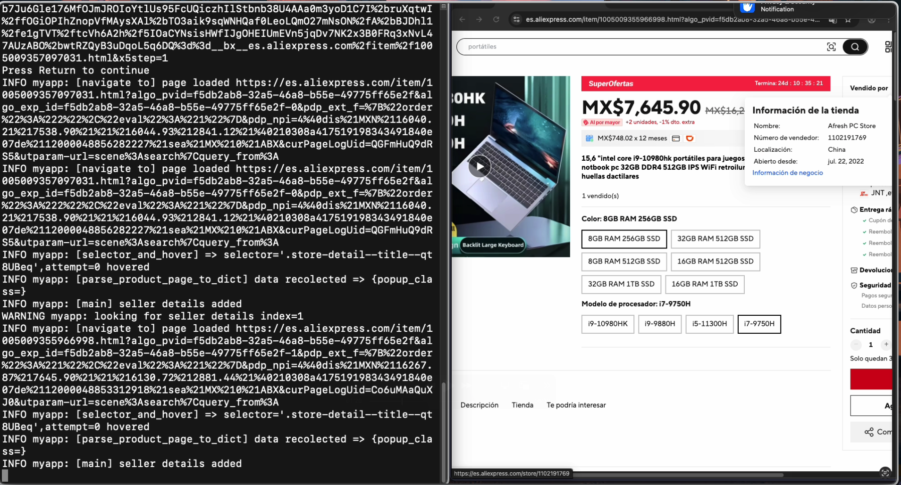
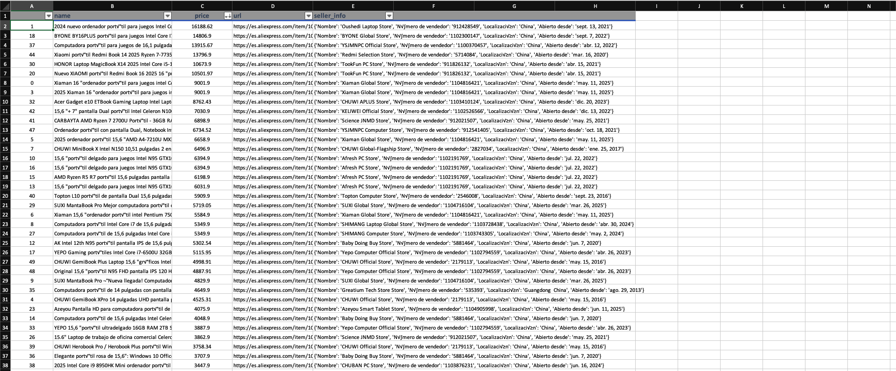
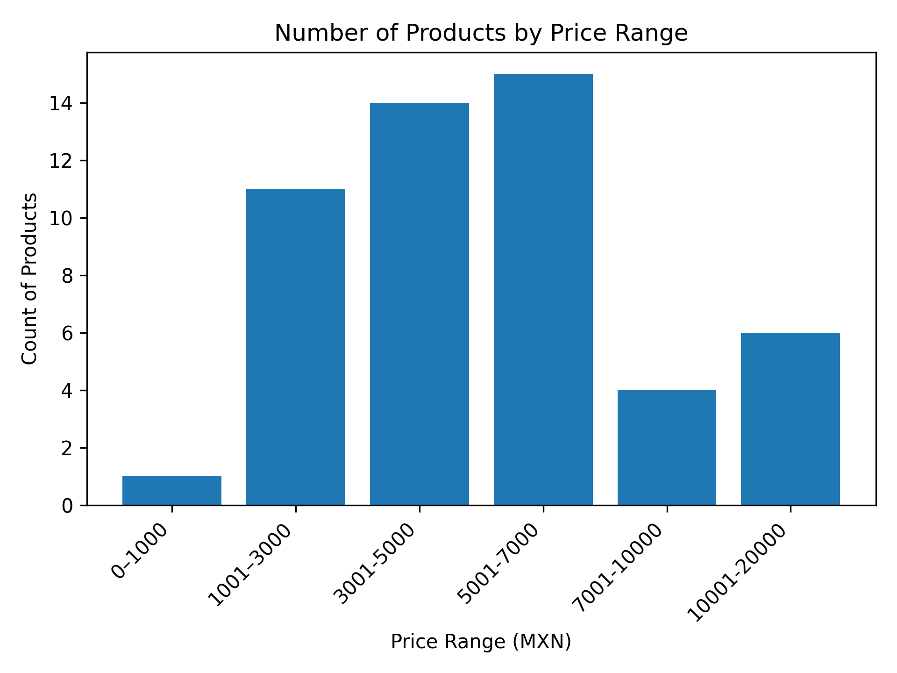

# AliExpress Scrapper 

This Python project is designed to show the process web scraping and data extraction from dynamic websites.  

---


## 🚀 Overview

This project is a Python-based tool for scraping product listings and seller information from AliExpress.  
It uses Selenium to navigate and load dynamic content, extracts seller details from popups, and saves the results into CSV or JSON files.  
A companion Jupyter Notebook is included to visualize the scraped data with summary charts.

The tool is easily customizable for different product categories by changing a few search parameters and CSS selectors.

---

## 🛠 Features

✅ Automates navigation and scrolling on dynamic AliExpress search result pages  
✅ Identifies each product card and triggers popups to retrieve **store (seller) details**  
✅ Extracts essential data such as store names and product URLs  
✅ Exports results into **CSV or JSON** for easy processing  
✅ Includes a **Jupyter Notebook** to load the scraped data and generate summary plots or charts 

✅ Configurable search queries and CSS selectors, making it adaptable for different product categories or future layout changes  
✅ Logs all scraping operations using Python’s built-in `logging` for full traceability

---


##  Project Structure

```
project/
├── drivers.py         # Sets up Selenium WebDriver instances
├── navigation.py      # Handles page navigation and scrolling
├── parsing.py         # Parses HTML and extracts data into dicts
├── utils.py           # Helper functions and shared utilities
├── log_config.py      # Configures consistent logging
├── main.py            # Entry point to run the scraper
├── requirements.txt   # Python dependencies
└── README.md

````

---

##  Installation

```bash
git clone https://github.com/Kikve/aliexpress-scrapper.git
cd project
pip install -r requirements.txt
````

Ensure you have a compatible version of Chrome and ChromeDriver installed.

---

##  Usage

```bash
python main.py
```

This example will scrape of product listings related to “laptops” and save the output to a CSV file.

<div align="center">
  
</div>

---

## 📝 Sample Output

| Product Name | Price | URL          | seller_info|
| ------------ | ----- | ------------ | ------------ |  
| Laptop A     | \$599 | https\://... |              |
| Laptop B     | \$799 | https\://... |              |

<div align="center">
  
</div>

---

## 📊 Jupyter Notebook

A Jupyter Notebook is included to help you explore and visualize the data collected by the scraper.

<div align="center">
  
</div>

### What it does
- Loads the CSV or JSON files generated by the scraper.
- Generates summary tables and plots such as:
  - The number of products found within each **price range**, helping to understand the distribution of prices across your search results.
- Makes it easy to analyze which price segments have the most listings.


---

## ⚙ Configuration

The following variables are defined at the start of the program to specify the scraping targets and control the extraction process:

| Variable                  | Description |
|----------------------------|-------------|
| `Query`                    | The search keyword for the product category to be scraped. In this example: `"laptops"`. |
| `Main_Url`                 | Constructs the URL to search for products on AliExpress using the specified query. For example: `https://es.aliexpress.com/w/wholesale-laptops.html` |
| `Card_class_component`     | The CSS class selector used to identify each product card on the search results page. |
| `Selector_product_popup`   | The CSS selector to locate the popup element or store details that appear when hovering over a product. |
| `Selector_product`         | The class used to identify the detailed product information container within the popup. |

---

## ⚠ Notes

* This tool is intended for use with explicit permission or for public data in compliance with the target website’s terms of service.
* Always review and comply with applicable laws and site policies before scraping.

---


## 📄 License

This project is licensed under the MIT License.


---

